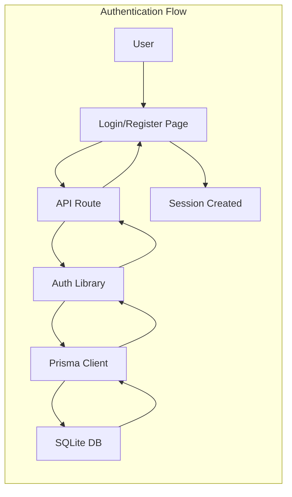
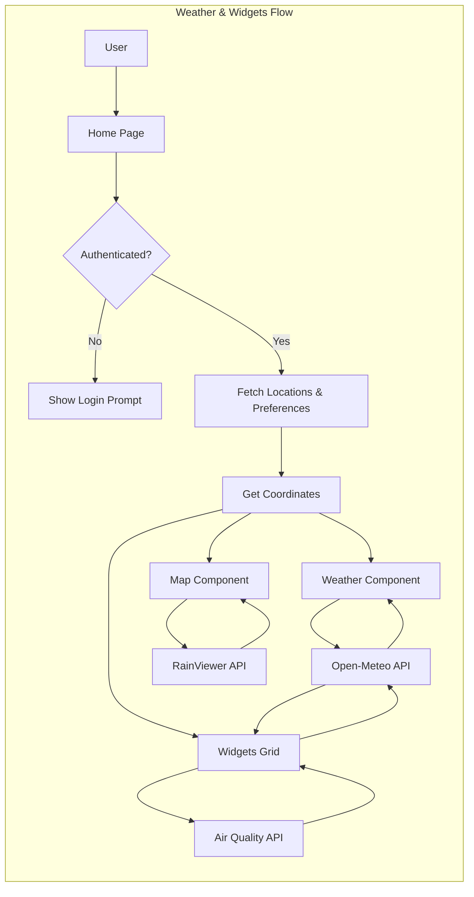
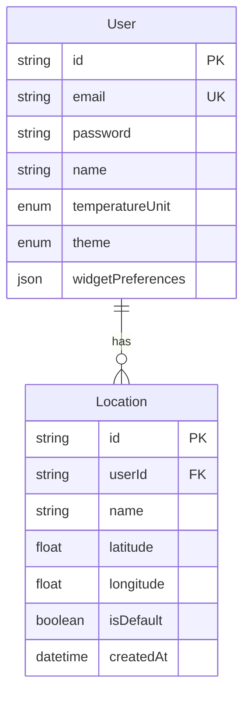

# Weather App Architecture

This document provides an overview of the Weather App's architecture, including its components, data flow, and external dependencies.

## System Overview

The Weather App is a full-stack Next.js application that provides user authentication, weather forecasting, location management, user preferences, and customizable weather widgets.

```mermaid
graph TB
    subgraph "Client Layer"
        Browser[Browser]
    end

    subgraph "Next.js Application"
        subgraph "Pages"
            HomePage[Home Page]
            LoginPage[Login Page]
            RegisterPage[Register Page]
            SettingsPage[Settings Page]
        end

        subgraph "Components"
            Weather[Weather Component]
            MapWrapper[Map Wrapper]
            Map[Map Component]
            LocationSelector[Location Selector]
            AddLocationModal[Add Location Modal]
            
            subgraph "Widgets"
                WidgetsGrid[Widgets Grid]
                Hourly[Hourly Forecast]
                Precip[Precipitation]
                UV[UV Index]
                Wind[Wind]
                AQI[Air Quality]
                Astronomy[Astronomy]
            end

            ThemeProvider[Theme Provider]
            Providers[Session Providers]
        end

        subgraph "API Routes"
            AuthAPI[NextAuth API]
            RegisterAPI[Register API]
            PreferencesAPI[Preferences API]
            LocationsAPI[Locations API]
        end

        subgraph "Libraries"
            AuthLib[Auth Config]
            PrismaLib[Prisma Client]
        end
    end

    subgraph "Data Layer"
        SQLite[(SQLite Database)]
    end

    subgraph "External Services"
        OpenMeteo[Open-Meteo API]
        GeocodingAPI[Geocoding API]
        AirQualityAPI[Air Quality API]
        RainViewer[RainViewer API]
        Leaflet[Leaflet/OpenStreetMap]
        Esri[Esri World Imagery]
    end

    Browser --> HomePage
    Browser --> LoginPage
    Browser --> RegisterPage
    Browser --> SettingsPage

    HomePage --> Weather
    HomePage --> MapWrapper
    HomePage --> LocationSelector
    HomePage --> WidgetsGrid
    
    WidgetsGrid --> Hourly
    WidgetsGrid --> Precip
    WidgetsGrid --> UV
    WidgetsGrid --> Wind
    WidgetsGrid --> AQI
    WidgetsGrid --> Astronomy

    MapWrapper --> Map
    LocationSelector --> AddLocationModal

    LoginPage --> AuthAPI
    RegisterPage --> RegisterAPI
    SettingsPage --> PreferencesAPI
    HomePage --> LocationsAPI

    AuthAPI --> AuthLib
    RegisterAPI --> PrismaLib
    PreferencesAPI --> PrismaLib
    LocationsAPI --> PrismaLib
    AuthLib --> PrismaLib

    PrismaLib --> SQLite

    Weather --> OpenMeteo
    WidgetsGrid --> OpenMeteo
    WidgetsGrid --> AirQualityAPI
    Map --> Leaflet
    Map --> RainViewer
    Map --> Esri
    AddLocationModal --> GeocodingAPI
```



## Component Architecture





## Technology Stack

### Frontend
- **Framework**: Next.js 16 (App Router)
- **Language**: TypeScript
- **Styling**: Tailwind CSS v4
- **UI Components**: Lucide React (icons)
- **Mapping**: React Leaflet + Leaflet
- **State Management**: React Hooks + LocalStorage (for location persistence)

### Backend
- **Runtime**: Node.js
- **Framework**: Next.js API Routes
- **Authentication**: NextAuth.js
- **Database ORM**: Prisma
- **Password Hashing**: bcryptjs

### Database
- **Type**: SQLite
- **Schema**: User, Location tables with relations

### External APIs
- **Weather Data**: Open-Meteo API (free, no API key required)
- **Geocoding**: Open-Meteo Geocoding API
- **Air Quality**: Open-Meteo Air Quality API
- **Radar/Satellite**: RainViewer API
- **Maps**: OpenStreetMap tiles, Esri World Imagery

## Data Models



## File Structure

```
weather-login-app/
├── app/
│   ├── api/
│   │   ├── auth/[...nextauth]/
│   │   │   └── route.ts          # NextAuth handler
│   │   ├── register/
│   │   │   └── route.ts          # User registration
│   │   ├── preferences/
│   │   │   └── route.ts          # User preferences (GET/PUT)
│   │   └── locations/
│   │       └── route.ts          # Location management (GET/POST/PUT/DELETE)
│   ├── login/
│   │   └── page.tsx              # Login page
│   ├── register/
│   │   └── page.tsx              # Registration page
│   ├── settings/
│   │   └── page.tsx              # Settings page
│   ├── layout.tsx                # Root layout with providers
│   ├── page.tsx                  # Home/Dashboard page
│   └── globals.css               # Global styles with dark mode
├── components/
│   ├── widgets/                  # Weather Widgets
│   │   ├── WidgetsGrid.tsx       # Grid container for widgets
│   │   ├── WidgetContainer.tsx   # Common widget wrapper
│   │   ├── HourlyForecast.tsx    # Hourly forecast widget
│   │   ├── PrecipitationWidget.tsx # Precipitation chart
│   │   ├── UVIndexWidget.tsx     # UV Index gauge
│   │   ├── WindWidget.tsx        # Wind compass
│   │   ├── AirQualityWidget.tsx  # AQI indicator
│   │   └── AstronomyWidget.tsx   # Sunrise/Sunset widget
│   ├── Map.tsx                   # Leaflet map with layers & RainViewer
│   ├── MapWrapper.tsx            # Dynamic map loader
│   ├── LocationSelector.tsx      # Location dropdown with portal
│   ├── AddLocationModal.tsx      # Location search modal
│   ├── ThemeProvider.tsx         # Theme context provider
│   ├── Providers.tsx             # Session & theme provider wrapper
│   └── Weather.tsx               # Weather display component
├── lib/
│   ├── auth.ts                   # NextAuth configuration
│   └── prisma.ts                 # Prisma client singleton
├── prisma/
│   └── schema.prisma             # Database schema
├── .env                          # Environment variables
└── package.json                  # Dependencies
```

## Key Features

### 1. Authentication
- **Type**: Credentials-based (email/password)
- **Security**: Passwords hashed with bcryptjs (10 rounds)
- **Case-Insensitive**: Emails normalized to lowercase
- **Session**: JWT-based sessions via NextAuth

### 2. Weather Forecast
- **Current Weather**: Temperature, weather code, icon
- **10-Day Forecast**: Daily high/low temps, weather icons
- **Units**: Configurable (Fahrenheit/Celsius)
- **Data Source**: Open-Meteo API
- **Auto-refresh**: Updates when location changes

### 3. Weather Widgets
- **Hourly Forecast**: 24-hour temperature timeline
- **Precipitation**: Rain/snow probability chart
- **UV Index**: Sun exposure gauge with safety tips
- **Wind**: Compass showing direction, speed, and gusts
- **Air Quality**: US AQI indicator with health descriptors
- **Astronomy**: Sunrise and Sunset times with visual arc
- **Customizable**: Toggle visibility in Settings

### 4. Location Management
- **Multiple Locations**: Save unlimited locations
- **Search**: City search via geocoding API
- **Default Location**: Set preferred location
- **Current Location**: Use device geolocation
- **Persistence**: Remembers last selected location via LocalStorage
- **Auto-focus**: Map re-centers when location changes

### 5. User Preferences
- **Temperature Units**: Fahrenheit or Celsius
- **Theme**: Light, Dark, or System
- **Dashboard Widgets**: Toggle widgets on/off
- **Persistence**: Saved to database
- **Immediate Feedback**: Changes apply instantly

### 6. Interactive Map
- **Provider**: Leaflet
- **Base Layers**: Street Map (OSM), Satellite (Esri)
- **Overlays**: Precipitation (Radar), Cloud Cover (Satellite) via RainViewer
- **Features**: Marker at location, popup, auto-refocus, layer control
- **Loading**: Dynamic import (SSR disabled)
- **Z-index Management**: Proper layering with portals

### 7. Theme System
- **Modes**: Light, Dark, System
- **CSS Variables**: Dynamic color switching
- **Smooth Transitions**: Animated color changes
- **System Detection**: Follows OS preference

## Security Considerations

1. **Password Storage**: Hashed with bcryptjs (never stored in plaintext)
2. **Email Normalization**: Prevents duplicate accounts with different cases
3. **Session Management**: JWT tokens with NextAuth
4. **Environment Variables**: Sensitive data in `.env` (gitignored)
5. **API Security**: Server-side validation for all endpoints
6. **Authorization**: User-specific data access controls
7. **SQL Injection**: Protected via Prisma ORM

## Performance Optimizations

1. **Dynamic Imports**: Map component loaded only on client-side
2. **Static Generation**: Login/Register pages pre-rendered
3. **React Portals**: Efficient modal/dropdown rendering
4. **Database Indexing**: Unique indexes on email
5. **Cascade Deletes**: Automatic cleanup of related data
6. **Optimistic Updates**: Immediate UI feedback
